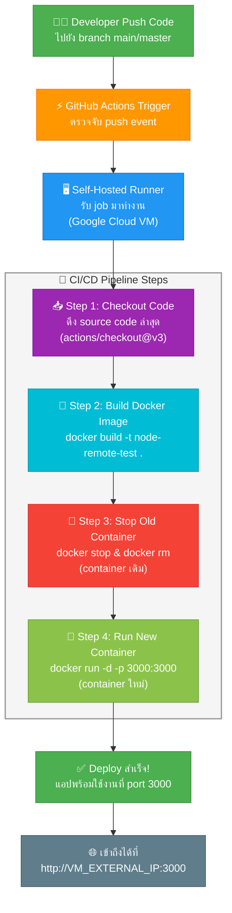

# Node.js Docker CI/CD Project

This project demonstrates a simple Node.js "Hello World" application that is Dockerized and deployed using a GitHub Actions CI/CD pipeline on a self-hosted runner.

## 🚀 How It Works

1.  **Code Change**: A developer pushes code changes to the `main` or `master` branch.
2.  **CI/CD Trigger**: GitHub Actions detects the push and triggers the workflow defined in `.github/workflows/deploy.yml`.
3.  **Self-Hosted Runner**: The job runs on your configured self-hosted runner (e.g., your Google Cloud VM).
4.  **Deployment Steps**:
    *   **checkout**: Pulls the latest code.
    *   **build**: Builds a new Docker image (`node-app-deploy`).
    *   **redeploy**: Stops and removes the old container (`node-app-container`), then starts a new one with the updated image.
5.  **Live**: The application becomes available on port 3000.

## 🛠️ Prerequisites

*   **Docker**: Must be installed on the machine running the application.
*   **GitHub Actions Runner**: A self-hosted runner must be configured and running on the target machine.

## 💻 Running Locally

To run the application manually without the pipeline:

1.  **Build the Image**:
    ```bash
    docker build -t node-app-manual .
    ```
2.  **Run the Container**:
    ```bash
    docker run -d -p 3000:3000 --name node-manual node-app-manual
    ```
3.  **Verify**:
    ```bash
    curl http://localhost:3000
    ```

## 🌐 Remote Access

To access the application from outside the VM:

1.  **Firewall Rule**: Ensure your cloud provider (e.g., Google Cloud) allows TCP traffic on port `3000`.
2.  **URL**: Visit `http://<YOUR_VM_EXTERNAL_IP>:3000`.

## 📂 Project Structure

*   `index.js`: The Node.js server code.
*   `Dockerfile`: Configuration to containerize the Node.js app.
*   `.github/workflows/deploy.yml`: The CI/CD pipeline definition.

---

## 📊 CI/CD Pipeline Diagram

แผนภาพแสดงขั้นตอนการทำงานของ Pipeline ตั้งแต่ Developer push code จนถึง Deploy สำเร็จ:



### 📝 สรุปขั้นตอน

| ขั้นตอน | รายละเอียด | เครื่องมือ |
|:---:|---|---|
| **1. Push Code** | Developer push code ไปยัง `main` หรือ `master` branch | Git |
| **2. Trigger** | GitHub Actions ตรวจจับ push event และเริ่มทำงาน | GitHub Actions |
| **3. Runner** | Self-hosted runner บน Google Cloud VM รับงาน | GitHub Runner |
| **4. Checkout** | ดึง source code ล่าสุดจาก repository | `actions/checkout@v3` |
| **5. Build** | สร้าง Docker image จาก `Dockerfile` | Docker |
| **6. Stop Old** | หยุดและลบ container เดิมที่กำลังทำงานอยู่ | Docker |
| **7. Run New** | เริ่ม container ใหม่จาก image ที่สร้างขึ้น | Docker |
| **8. Live** | แอปพลิเคชันพร้อมใช้งานที่ port `3000` | HTTP |
