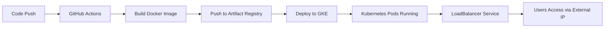

# วิธีนำ Node.js Container ขึ้น GKE (Google Kubernetes Engine)

จากโปรเจกต์ `devsecops-learning` ที่มี Dockerfile พร้อมแล้ว ขั้นตอนการ deploy ขึ้น GKE มีดังนี้:

---

## สิ่งที่ต้องเตรียม (Prerequisites)

- **Google Cloud Account** พร้อม billing enabled
- **`gcloud` CLI** ติดตั้งแล้ว → [ดาวน์โหลด](https://cloud.google.com/sdk/docs/install)
- **`kubectl`** ติดตั้งแล้ว (`gcloud components install kubectl`)
- **Docker** ติดตั้งแล้ว (มีอยู่แล้วจากขั้นตอนก่อนหน้า)

---

## ขั้นตอนทั้งหมด

### Step 1: ตั้งค่า Google Cloud Project

```bash
# Login เข้า Google Cloud
gcloud auth login

# สร้าง project (ข้ามได้ถ้ามีแล้ว)
gcloud projects create <YOUR_PROJECT_ID> --name="My Project"

# เลือก project
gcloud config set project <YOUR_PROJECT_ID>

# เปิด billing (ต้องทำผ่าน Console ถ้ายังไม่ได้เปิด)
# https://console.cloud.google.com/billing

# เปิด APIs ที่จำเป็น
gcloud services enable container.googleapis.com
gcloud services enable artifactregistry.googleapis.com
```

> [!IMPORTANT]
> แทนที่ `<YOUR_PROJECT_ID>` ด้วย Project ID ของคุณทุกที่ที่เห็นในคู่มือนี้

---

### Step 2: สร้าง Artifact Registry Repository (เก็บ Docker Image)

```bash
# ตั้ง region
gcloud config set compute/region us-central1

# สร้าง Docker repository ใน Artifact Registry
gcloud artifacts repositories create my-app-repo \
  --repository-format=docker \
  --location=us-central1 \
  --description="Docker repository for Node.js app"

# ตั้งค่า Docker auth สำหรับ Artifact Registry
gcloud auth configure-docker us-central1-docker.pkg.dev
```

---

### Step 3: Build & Push Docker Image ไปยัง Artifact Registry

```bash
# เข้าไปในโฟลเดอร์โปรเจกต์
cd ~/Desktops/devsecops-learning

# Build image พร้อม tag สำหรับ Artifact Registry
docker build -t us-central1-docker.pkg.dev/<YOUR_PROJECT_ID>/my-app-repo/node-hello-world:v1 .

# Push image ขึ้น Artifact Registry
docker push us-central1-docker.pkg.dev/<YOUR_PROJECT_ID>/my-app-repo/node-hello-world:v1
```

---

### Step 4: สร้าง GKE Cluster

```bash
# สร้าง Autopilot cluster (แนะนำ - จัดการง่าย, จ่ายตาม pod ที่ใช้จริง)
gcloud container clusters create-auto my-gke-cluster \
  --location=us-central1
```

> [!NOTE]
> **Autopilot vs Standard**: Autopilot จัดการ node pool ให้อัตโนมัติ เหมาะสำหรับเริ่มต้น ไม่ต้องกังวลเรื่อง node provisioning
> ถ้าต้องการ Standard cluster ใช้คำสั่ง:
> ```bash
> gcloud container clusters create my-gke-cluster \
>   --location=us-central1-a \
>   --num-nodes=2 \
>   --machine-type=e2-small
> ```

```bash
# เชื่อมต่อ kubectl กับ cluster
gcloud container clusters get-credentials my-gke-cluster \
  --location=us-central1
```

---

### Step 5: สร้างไฟล์ Kubernetes Manifests

สร้างไฟล์ 2 ไฟล์ใน project:

#### 5.1 `k8s/deployment.yaml`

```yaml
apiVersion: apps/v1
kind: Deployment
metadata:
  name: node-hello-world
  labels:
    app: node-hello-world
spec:
  replicas: 2
  selector:
    matchLabels:
      app: node-hello-world
  template:
    metadata:
      labels:
        app: node-hello-world
    spec:
      containers:
        - name: node-hello-world
          image: us-central1-docker.pkg.dev/<YOUR_PROJECT_ID>/my-app-repo/node-hello-world:v1
          ports:
            - containerPort: 3000
          resources:
            requests:
              cpu: "250m"
              memory: "128Mi"
            limits:
              cpu: "500m"
              memory: "256Mi"
```

#### 5.2 `k8s/service.yaml`

```yaml
apiVersion: v1
kind: Service
metadata:
  name: node-hello-world-service
spec:
  type: LoadBalancer
  selector:
    app: node-hello-world
  ports:
    - protocol: TCP
      port: 80
      targetPort: 3000
```

> [!TIP]
> - **`type: LoadBalancer`** จะสร้าง External IP ให้เข้าถึงจากอินเทอร์เน็ตได้
> - **`port: 80`** = port ที่ user เข้าถึง, **`targetPort: 3000`** = port ของ container

---

### Step 6: Deploy ขึ้น GKE

```bash
# Apply manifests
kubectl apply -f k8s/deployment.yaml
kubectl apply -f k8s/service.yaml

# ตรวจสอบสถานะ
kubectl get deployments
kubectl get pods
kubectl get services
```

รอสักครู่ (**EXTERNAL-IP** ของ service อาจใช้เวลา 1-2 นาที):

```bash
# ดู External IP
kubectl get service node-hello-world-service --watch
```

เมื่อได้ **EXTERNAL-IP** แล้ว ทดสอบ:

```bash
curl http://<EXTERNAL-IP>
# ควรได้: Hello World! 2026 Koko
```

---

## (Bonus) อัปเดต GitHub Actions ให้ Deploy ขึ้น GKE อัตโนมัติ

ถ้าต้องการ CI/CD ผ่าน GitHub Actions → GKE ให้อัปเดต `.github/workflows/deploy.yml`:

```yaml
name: Build and Deploy to GKE

on:
  push:
    branches: [main, master]

env:
  PROJECT_ID: ${{ secrets.GCP_PROJECT_ID }}
  GKE_CLUSTER: my-gke-cluster
  GKE_ZONE: us-central1
  REPOSITORY: my-app-repo
  IMAGE: node-hello-world

jobs:
  build-and-deploy:
    runs-on: ubuntu-latest

    permissions:
      contents: read
      id-token: write

    steps:
      - name: Checkout code
        uses: actions/checkout@v4

      # ใช้ Workload Identity Federation (แนะนำ) หรือ Service Account Key
      - name: Authenticate to Google Cloud
        uses: google-github-actions/auth@v2
        with:
          credentials_json: ${{ secrets.GCP_SA_KEY }}

      - name: Set up Cloud SDK
        uses: google-github-actions/setup-gcloud@v2

      - name: Configure Docker for Artifact Registry
        run: gcloud auth configure-docker us-central1-docker.pkg.dev --quiet

      - name: Build Docker image
        run: |
          docker build -t us-central1-docker.pkg.dev/$PROJECT_ID/$REPOSITORY/$IMAGE:$GITHUB_SHA .
          docker build -t us-central1-docker.pkg.dev/$PROJECT_ID/$REPOSITORY/$IMAGE:latest .

      - name: Push Docker image
        run: |
          docker push us-central1-docker.pkg.dev/$PROJECT_ID/$REPOSITORY/$IMAGE:$GITHUB_SHA
          docker push us-central1-docker.pkg.dev/$PROJECT_ID/$REPOSITORY/$IMAGE:latest

      - name: Get GKE credentials
        uses: google-github-actions/get-gke-credentials@v2
        with:
          cluster_name: ${{ env.GKE_CLUSTER }}
          location: ${{ env.GKE_ZONE }}

      - name: Deploy to GKE
        run: |
          kubectl set image deployment/node-hello-world \
            node-hello-world=us-central1-docker.pkg.dev/$PROJECT_ID/$REPOSITORY/$IMAGE:$GITHUB_SHA
          kubectl rollout status deployment/node-hello-world
```

### GitHub Secrets ที่ต้องตั้ง

| Secret Name | ค่า |
|---|---|
| `GCP_PROJECT_ID` | Project ID ของ Google Cloud |
| `GCP_SA_KEY` | JSON key ของ Service Account (ดูขั้นตอนด้านล่าง) |

### สร้าง Service Account สำหรับ GitHub Actions

```bash
# สร้าง Service Account
gcloud iam service-accounts create github-actions-sa \
  --display-name="GitHub Actions SA"

# ให้สิทธิ์
gcloud projects add-iam-policy-binding <YOUR_PROJECT_ID> \
  --member="serviceAccount:github-actions-sa@<YOUR_PROJECT_ID>.iam.gserviceaccount.com" \
  --role="roles/container.developer"

gcloud projects add-iam-policy-binding <YOUR_PROJECT_ID> \
  --member="serviceAccount:github-actions-sa@<YOUR_PROJECT_ID>.iam.gserviceaccount.com" \
  --role="roles/artifactregistry.writer"

# สร้าง JSON key
gcloud iam service-accounts keys create key.json \
  --iam-account=github-actions-sa@<YOUR_PROJECT_ID>.iam.gserviceaccount.com

# เอาเนื้อหาใน key.json ไปใส่ใน GitHub Secret: GCP_SA_KEY
cat key.json
```

> [!CAUTION]
> อย่าลืมลบไฟล์ `key.json` หลังจากเพิ่ม secret แล้ว เพื่อความปลอดภัย:
> ```bash
> rm key.json
> ```

---

## คำสั่งที่ใช้บ่อย

| คำสั่ง | ใช้ทำอะไร |
|---|---|
| `kubectl get pods` | ดู pods ทั้งหมด |
| `kubectl get services` | ดู services + External IP |
| `kubectl logs <pod-name>` | ดู logs ของ pod |
| `kubectl describe pod <pod-name>` | ดูรายละเอียด pod |
| `kubectl scale deployment node-hello-world --replicas=3` | เพิ่ม/ลด replicas |
| `kubectl delete -f k8s/` | ลบ resources ทั้งหมด |

---

## สรุป Flow ทั้งหมด


